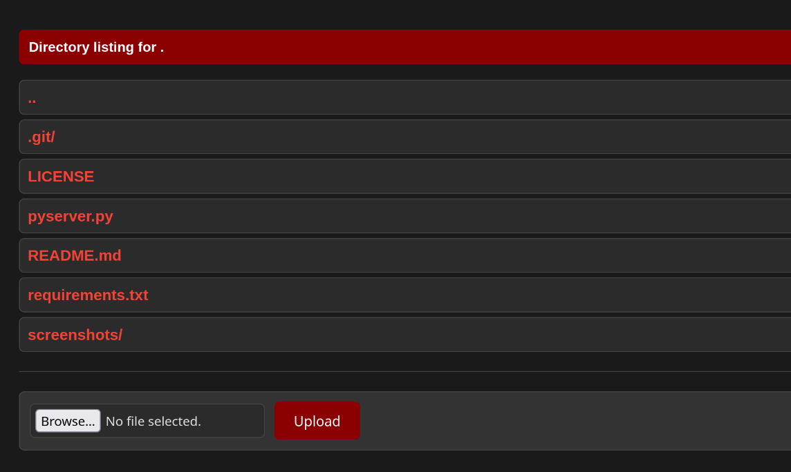
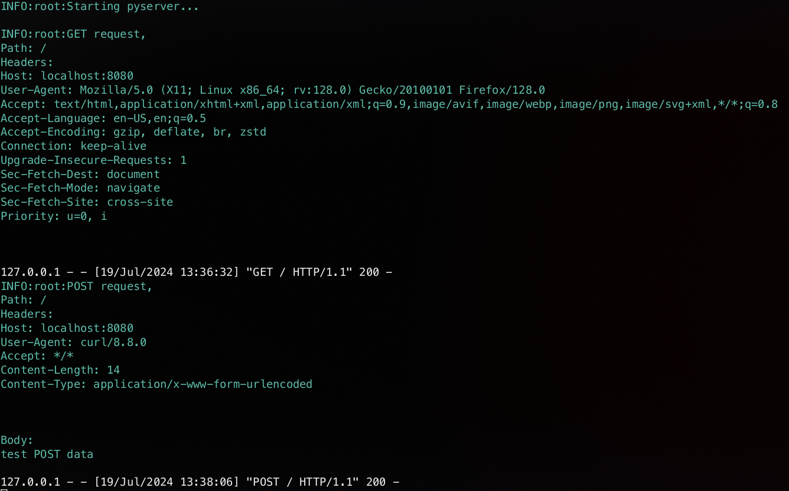

# PyServer

PyServer is a simple, multithreaded Python HTTP GET & POST server that logs requests and provides a fancy, modern, and dark-themed directory listing. This server is perfect for quickly sharing files and directories over a network with minimal setup.

<br>

## Features

- HTTP GET and POST requests
- Serves files and directories with a modern dark-themed listing.
- Multithreaded for improved performance.
- Logs HTTP requests with colored output for better readability.
- Easy to set up and run.

<br>

## Requirements

- Python 3.x
- `colorlog` library for colored logging output.

<br>

## Installation

1. Clone the repository or download the `pyserver.py` file.
2. Install the required `colorlog` library if you haven't already:

```bash
pip install colorlog
```

or install the requirement from requirements.txt:

```bash
pip install -r requirements.txt
```

<br>

## Usage

Run the server with the following command:
```bash
python3 ./pyserver.py [port]
```
If no port is specified, the server will default to port 8080.

Example:
```bash
python3 ./pyserver.py 8000
```

<br>

## Screenshots

directory listing:
<br>


request logging:


<br>

## License

This project is licensed under the MIT License - see the LICENSE file for details.
Contributing

Contributions are welcome! Please feel free to submit a Pull Request.
Acknowledgments

Inspired by the need for a simple, yet modern and stylish, Python HTTP server for quick file sharing and directory listing.

<br>

## Credits

This project was inspired by the work of Miel Donkers
See: <a href="https://gist.github.com/mdonkers/63e115cc0c79b4f6b8b3a6b797e485c7">https://gist.github.com/mdonkers/63e115cc0c79b4f6b8b3a6b797e485c7</a>
